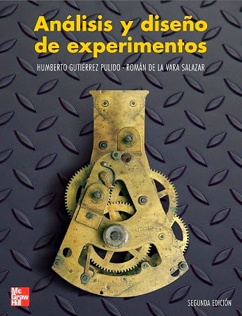
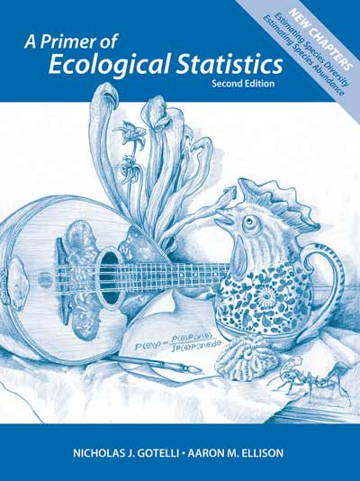

---
title: "Diseño de Experimentos"
subtitle: 'Escuela de Microbiología - Universidad de Antioquia'
author: "Carlos Neftaly Lozano"

output: 
  ioslides_presentation:
  css: doe2.css
  header-includes:
  - \usepackage{color}
    
---

```{r setup, include=FALSE}
knitr::opts_chunk$set(echo = FALSE)
```

## 

```{r, echo=FALSE,fig.align='center'}
   knitr::include_graphics('./figure/In-1.png')
```

## Libros guía
<div class="columns-2">
```{r, echo=FALSE,fig.align='left'}
   
```

 - **Análisis y Diseño de experimentos**
 - Biblioteca UdeA: 658.5/G984
 
</div>


## Libros guía
<div class="columns-2">
```{r, echo=FALSE,fig.align='left'}
   
```

 - **A Primer of Ecological Statistics**
 - Biblioteca UdeA: 574.5012/G683
 
</div>

## Libros guía
<div class="columns-2">
```{r, echo=FALSE,fig.align='left'}
   knitr::include_graphics('./figure/EE.jpg')
```

 - **Experimental design and data analysis for biologists**
 - Biblioteca UdeA: 574.015195/Q7
 
</div>


## Evaluación

__3 Examenes parciales: 65%__

  + Examen 1: 20 %
  + Examen 2: 25%
  + Examen 3: 20
 
Roses are <span style="color:red">red</span>, 
violets are <span style="color:blue">blue</span>.
 
 
 __Seguimiento: 35%__
 
+ Trabajo final: 15%
+ Asignacionaciones semanales: 15% 
+ Quices online: 5% 


## Slide with Bullets


## Slide with R Output

```{r cars, echo = TRUE}
summary(cars)
```

## Slide with Plot

```{r pressure}
plot(pressure)
```

